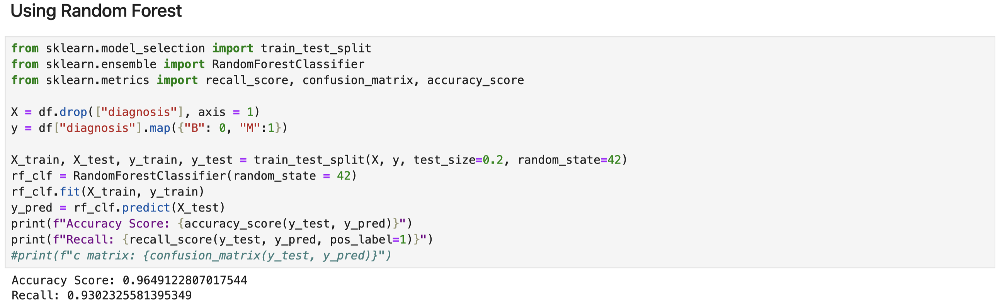
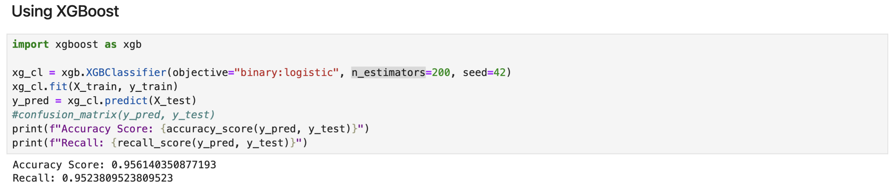

## BREAST CANCER DETECTION

This is a small project that I did for a revision of whatever I learnt in the past days. Details of the project are provided
below.

### Objective

The objective of this project is to build a machine learning model that can accurately classify tumors as malignant or
benign using the features provided in the dataset. The focus is on maximizing recall (the ability to detect malignant cases) 
since early diagnosis of cancer is critical for patient survival.   

### Dataset

The dataset is sourced from the **Breast Cancer Wisconsin (Diagnostic)** Data Set on Kaggle, which contains 569 observations
and 30 features derived from images of breast masses. The target variable **(diagnosis)** has two classes:

**M: Malignant (cancerous)**  
**B: Benign (non-cancerous)**

### Tasks 

- Loaded the dataset and observed it. Found an unnecessary column named **Unnamed: 32** which had only NAN values. So, I 
dropped it and revisited the dataset. Other columns were fine and had no null values.    
- Splitted data into training and testing set. The dataset has total of 569 datas where 357 were **"B" (Benign) i.e. no cancer**
and 212 were **"M" (Malignant) i.e. cancer**. I tried **Random Forest**, **KNN** and **XGBoost** for the classification.
**KNN** really didn't perform well, so not including it. While **randomly sampled**, the results were as follows:    
**Random Sampling**   

  | Metrics | Random Forest | XGBoost |
  | ---- | ----| ---|
  | Accuracy Score | 0.9649 | 0.9561 |
   | Recall | 0.9302 | 0.9523 |    
 
         
        Since we had smaller dataset and the data was kind of imbalanced. So, thought of using **Stratified Sampling Method**.
     The performances are tabulated below:    
  **Stratified Sampling**   

  | Metrics | Random Forest | XGBoost |
  | ---- |---------------|---------|
  | Accuracy Score | 0.9561        | 0.9737  |
   | Recall | 0.8809        | 1.0     |    

In this Project, we need to focus on **recall** rather than other metrics as In cancer detection, a higher recall ensures 
that as many actual cancer cases as possible are identified, reducing the risk of missing patients who have cancer. 
Missing a cancer diagnosis (false negative) can delay treatment, potentially leading to worse health outcomes. Although 
higher recall may increase false positives, it prioritizes catching all possible cancer cases, which is crucial for early 
intervention and treatment. So, found **XGBoost** as a better choice and thought of fine tune its hyperparameter &
increased the **Accuracy Score** from **0.9737** to **0.9912**. Also, the **cross-validation score** increased from something
around **0.96** to **0.97**.

___
