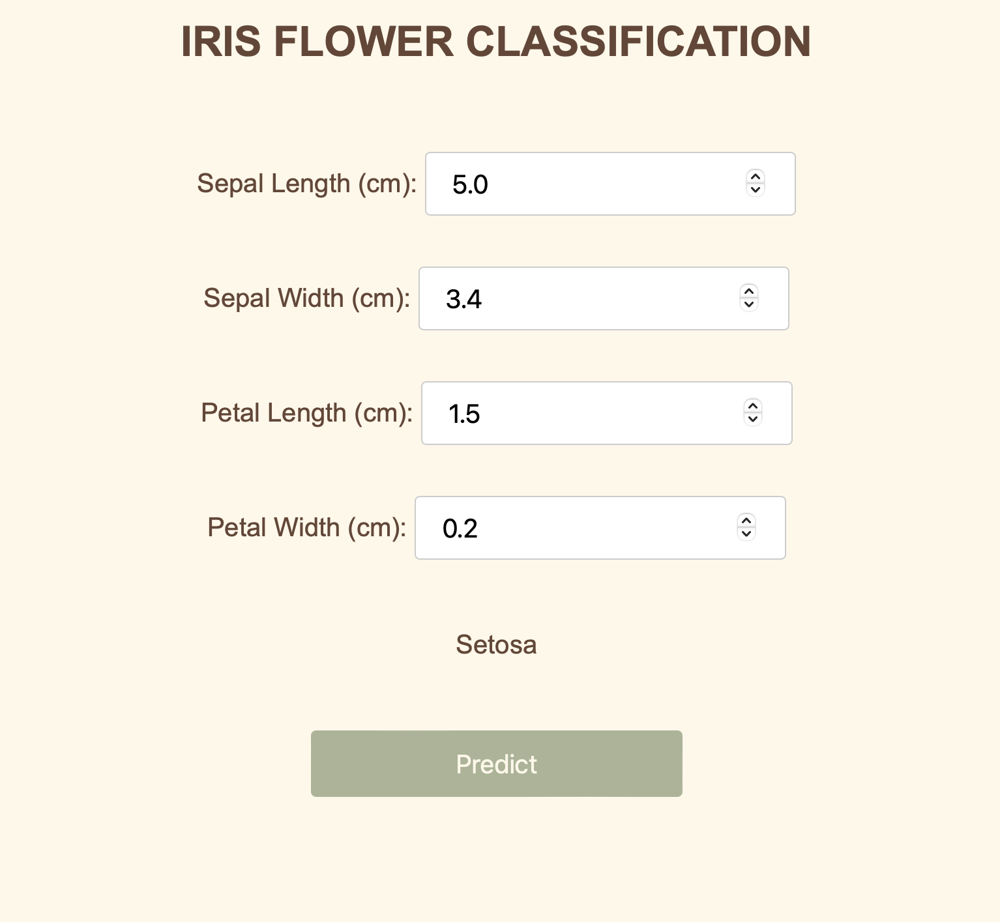
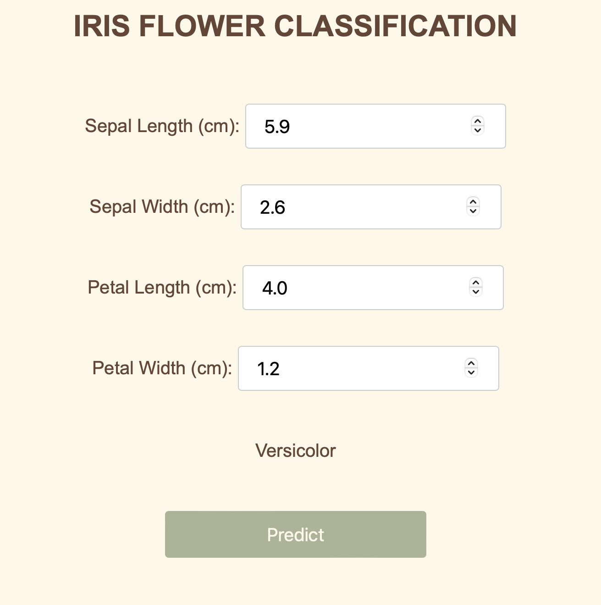
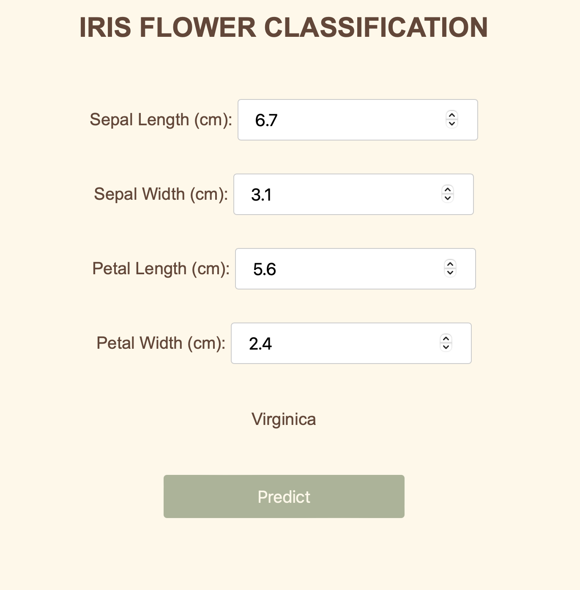

## IRIS FLOWER CLASSIFICATION PROJECT

The Iris flower classification project is a classic machine learning project that involves 
classifying Iris flowers into one of three species based on measurements of their physical attributes. 
The project uses the Iris dataset, which is widely used for educational purposes in data science and machine learning.
   
**Goal :** The goal is to build a machine learning model that can predict the species of an Iris flower based on the
measurements of its sepal and petal dimensions.
   
**Features :** The dataset contains four features for each flower:  
- Sepal Length (cm)
- Sepal Width (cm)
- Petal Length (cm)
- Petal Width (cm)    

**Labels :** The dataset includes three species of Iris flowers:  
- Setosa
- Versicolor
- Virginica

   
I didn't spend much on decorating the interface, rather focused on learning the
core i.e. deployment. Below are few screenshots of the predictions made:    
 

   

   

___